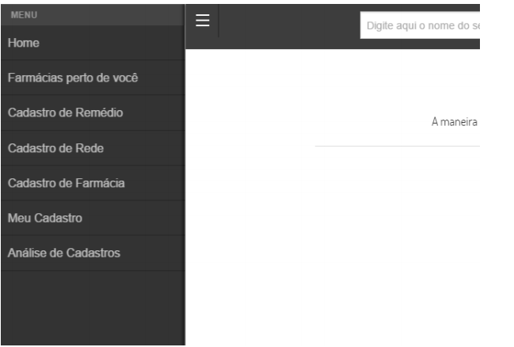

# FARMACIA CONJUNTA
***	
### Telas a serem feitas:

#### 1.	Menu Principal.

O menu do Farmácia Conjunta, representado na Figura 9, está localizado a
esquerda da tela, para ter acesso é necessário pressionar o ícone em formato de 
30
três barras horizontais no canto superior esquerdo. Após pressionar o ícone o menu
é deslizado e ocupa parte do canto esquerdo. Através dele o usuário tem a
possiblidade de acessar as demais funcionalidades que o sistema dispõe.

### 2. Tela de login.

Ao clicar no botão barra efetuar o login, o sistema abre uma janela modal
contendo os campos de usuário e senha, e logo abaixo um botão para efetuar o
acesso, como mostra a Figura 10.

### 3. Tela de mapa de farmácias.

Através da tela citada na Figura 11, o usuário possui acesso ao mapa de
farmácias, onde o mesmo pode localizar a farmácias da região informada em um
raio de 2 km

### 4. Tela de cadastro de remédios.

Para realizar o cadastro de medicamentos não encontrados no sistema, e
consequentemente não apresentado no menu de busca, o usuário deve acessar a
tela de Cadastro de Remédio (Figura 12), localizada no menu. A mesma contém
campos que são necessários para que seja feita uma melhor identificação dos
remédios cadastrados. Para efetuar o cadastro de um novo medicamento é
necessário que o usuário tenha acessado o sistema. Ao fim do procedimento, o
remédio será enviado para aprovação do administrador do sistema.

### 5. Tela de cadastro de redes.

A tela Cadastro de Rede, representada pela Figura 13, possibilita ao usuário
cadastrar uma rede de farmácia ainda inexistente no sistema. Para realizar o
procedimento, o usuário ter acessado o sistema e informar obrigatoriamente o nome
da rede. Ao fim do procedimento, a rede será enviada para aprovação do
administrador do sistema

### 6. Tela de cadastro de farmácias.

Caso a farmácia desejada não exista no sistema ao informar o preço do
remédio, o usuário pode realizar o cadastro da mesma através da tela Cadastro de
Farmácia (Figura 14). O procedimento tem sucesso ao usuário realizar o acesso ao
sistema, preencher todos os campos e pressionar o botão salvar. Ao fim do
procedimento, a farmácia será enviada para aprovação do administrador do sistema

### 7. Tela de análise de cadastros.

Na tela de Análise de Cadastro (Figura 15), o usuário com perfil de
administrador tem a possibilidade de aceitar, editar ou recusar cadastros de
remédios, redes e farmácias feitas por usuários do sistema. Está tela só é exibida
para usuário com perfil de administrador do sistema

### 8. Tela de consulta de preços.

Através da tela de consulta de preços, representada pela Figura 16, o
usuário tem a possiblidade de consultar os preços mais baixos de cada farmácia do
remédio solicitado. Realizando a busca na parte superior da tela, inserindo o nome
do remédio e clicando no resultado, será carregada a tela contendo as informações
de menor e maior preço e economia. O colaborador pode realizar uma nova busca
selecionando unidade federativa e a cidade e pressionando o botão buscar, onde
será exibida a lista de farmácias com seus respectivos valores do remédio
consultado, ordenando do menor para maior valor, sempre exibindo a ultima
atualização do remédio em cada farmácia.

,
### 9. Tela de cadastro de usuários.

A tela Cadastro de Usuário, representada pela Figura 17, possibilita o
cadastro de usuários no sistema, que é necessário para acessar algumas
funcionalidades. Deve-se preencher todos os campos e então clicar no botão
Cadastrar. 

### 10. Tela de tela ínicial.

A Figura 8 exibe a tela principal do sistema. Ao entrar nela o usuário se
depara com uma breve explicação do que se trata o sistema, sendo exibidos alguns
ícones com algumas funcionalidades que o usuário pode realizar. No topo da tela é
mostrada a barra de pesquisa, também apresentada em todas as telas do sistema,
através dela que se da a busca de medicamentos. Assim como a barra de pesquisa,
nesta e em todas as outras telas está presente à opção de o usuário realizar login no
sistema, caso ele se encontre com acesso é mostrado uma mensagem de boas
vindas.

